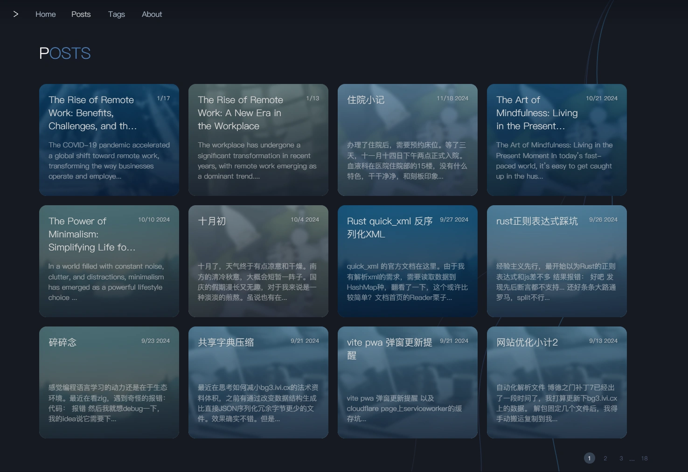
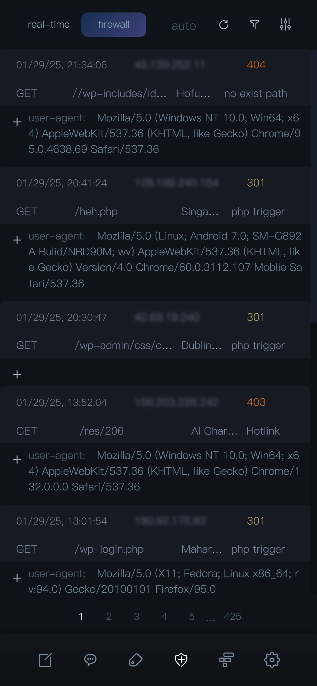

# A personal blog system


Here is my personal blog. I am currently using it to
record my daily life and a small amount of technical
experience. It is suitable for deployment on a vps with
a bun environment. I didn't do any functional support
in the direction of SEO or business, emm... it is only
suitable for writing, and the theme cannot be modified.
If you are interested in it, welcome to fork it.


The code of the current project is still very messy
and far from the standard of an open source project.

### Features

- SSR+PWA
- Responsive web design for mobile and pc
- Comments management
- Firewall
- Article management
- Tags management
- Files management
- Permissions management
- Visit Statistics
- backup to local and upload recovery
- Image upload compression


### Deploy
1. Build
```bash
bun i
bun run build
```
2. Upload the dist folder to your vps.
3. Run
```bash
cd dist
bun i
bun --bun run start
```


### Screenshots

#### PC



### Mobile




