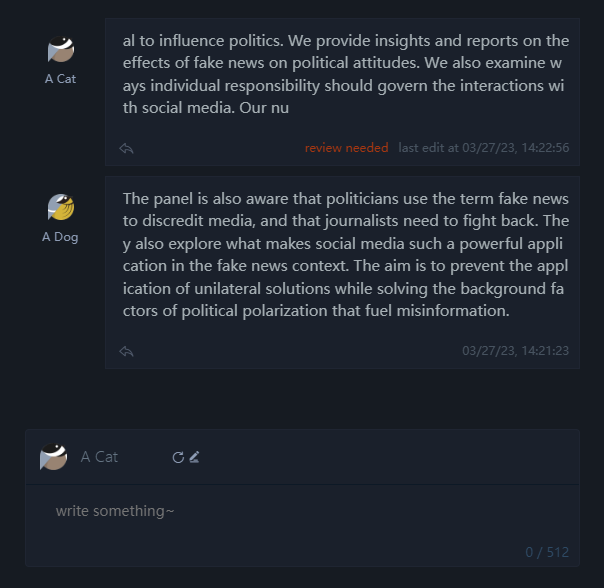
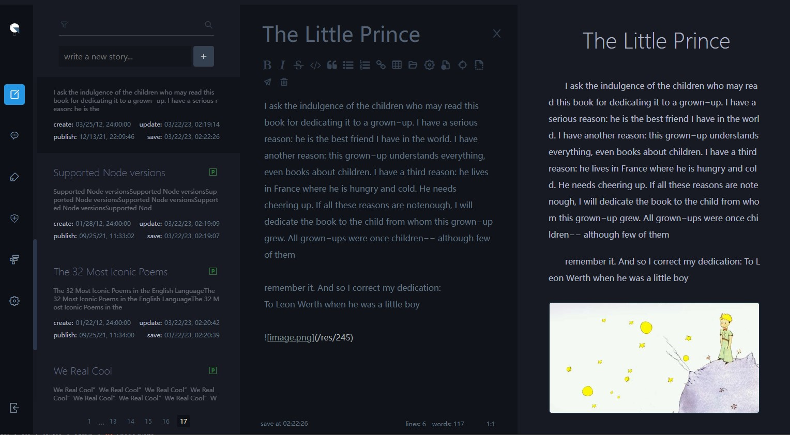
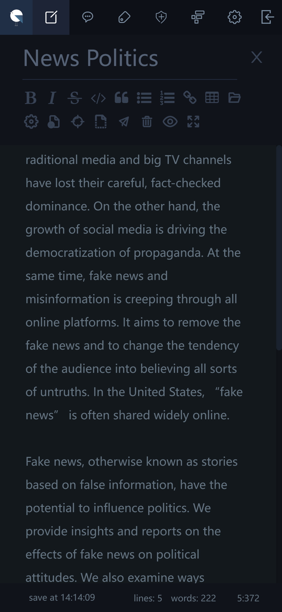
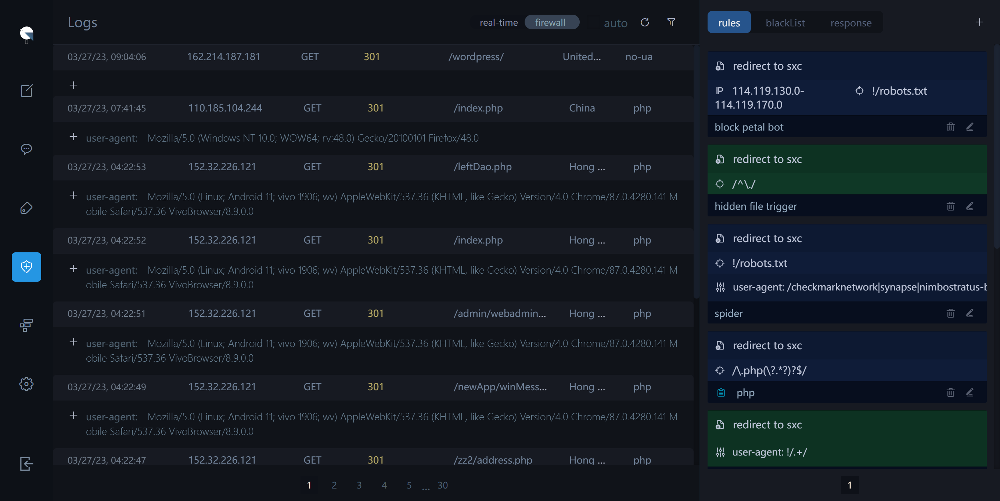
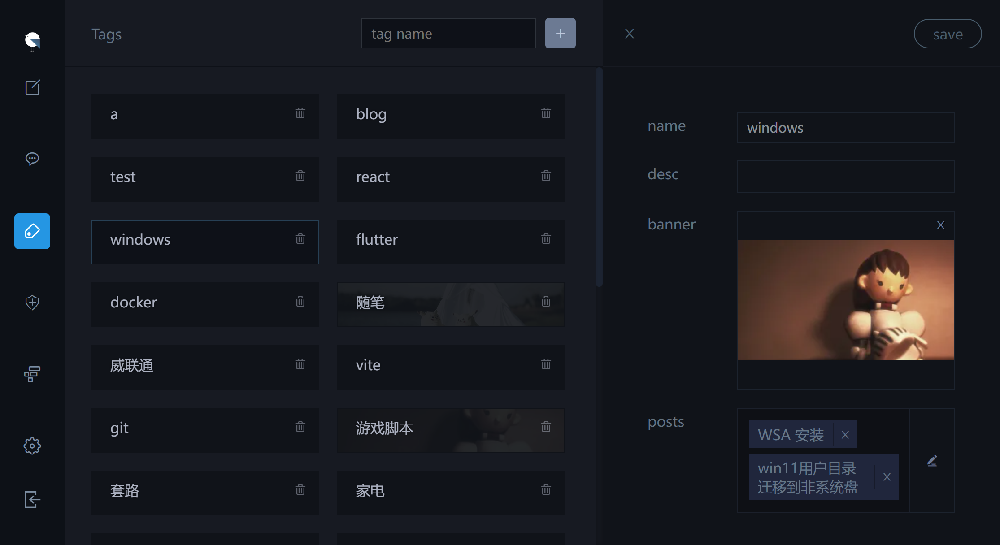
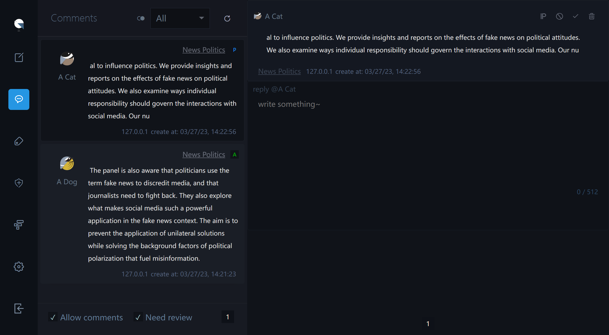

# a personal blog system

It's my personal blog system just for the enjoy of writing,
not for SEO, not for socializing, not for sharing.
I needed a place to write my thoughts and feelings,
so I created it. Probably, there may still be bugs
and improvements to be found, and the style of blog can't
be change (no themes), so I wouldn't recommend
using this as your personal blog. If you still like it
and want to use it, welcome to fork.

### Tech Stack

[svelteKit](https://github.com/sveltejs/kit)+
[bun:sqlite](https://bun.sh/docs/api/sqlite)

### features

- ssr+pwa
- mobile friendly (safari may not)
- `EasyMDE` editor
- built-in comment system
- built-in firewall (you can use this to prevent hotlink or spider scanning)
- tags manage
- permissions management (example: Some posts in a special group cannot be seen by visitors if they don't have some permission)
- backup to local and upload recovery

### partial preview

- front:

  - posts list
    

  - comments:

    

- backstage:

  - write post
    
  - on mobile ui

    

  - file manager

    

  - firewall
    
  - tags manage
    
  - comments manage
    

### deploy

You need a nodejs environment vps.

- step1: build locally
  ```bash
  npm run build
  ```
- step2: add package.json
  ```bash
  npm run publish
  ```
- step3: upload the dist folder to your vps

- optional: edit the `.env.production` in dist folder if you want change the bind port

- step4: run it (If you need to run in the background, you could add it to `pm2` or add a service)
  ```bash
  npm run start
  ```
