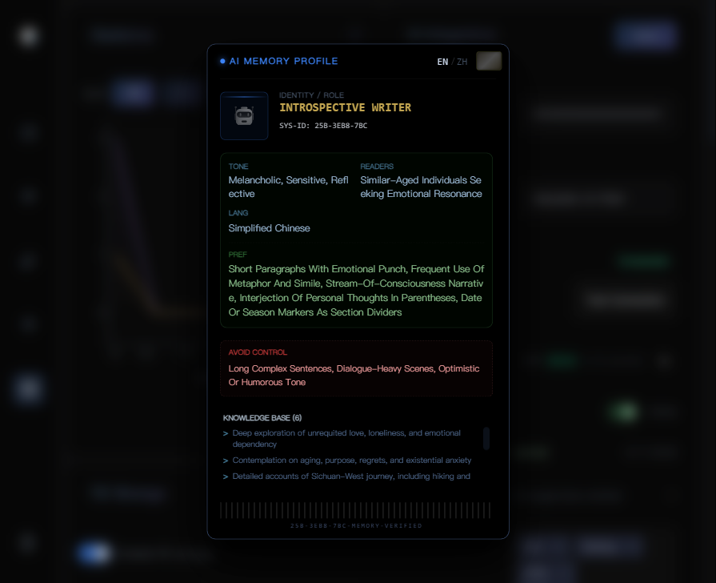
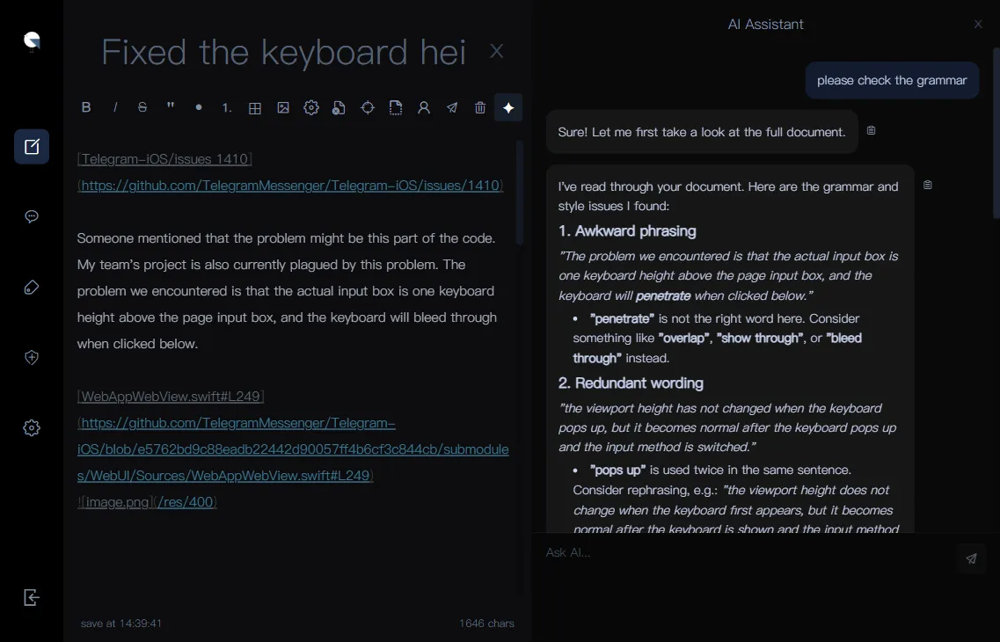
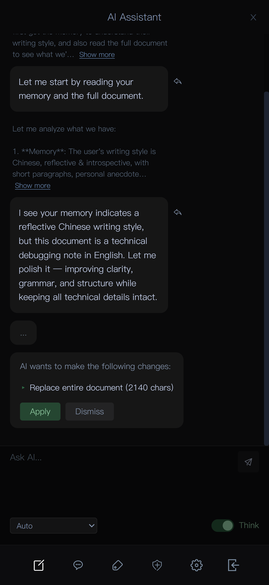

# EMM - Modern Self-Hosted Blog System


A modern self-hosted markdown blog system powered by SvelteKit, Bun, and DeepSeek AI. Features built-in security firewall and smart writing assistant.

## Contents

- [Screenshots](#screenshots)
- [Features](#features)
- [AI Assistant](#ai-assistant)
- [Tech Stack](#tech-stack)
- [Getting Started](#getting-started)
- [Turnstile Anti-Crawl Setup](#turnstile-anti-crawl-setup)
- [Contributing](#contributing)
- [License](#license)

## Screenshots

### Desktop

<p>
  <br/><br/>
  <br/><br/>
  <br/><br/>
  <br/><br/>
  <br/><br/>
  <br/><br/>
  
  
  
</p>

### Mobile

<p>
  
  
  
  
  
  
</p>

## Features

- **SSR + PWA** — Server-side rendering with offline support via service workers
- **Responsive Design** — Optimized for both desktop and mobile devices
- **Markdown Editor** — Full-featured editor built on CodeMirror 6 with custom toolbar and paste-to-upload
- **Mermaid Diagrams** — Render flowcharts and diagrams in posts with SSR support
- **Syntax Highlighting** — Code blocks styled with highlight.js
- **Article Management** — Create, edit, and organize markdown posts with version diff history
- **Tags** — Categorize content with a tag system; Chinese titles auto-generate pinyin slugs
- **Comments** — Built-in comment management with moderation support
- **File Management** — Upload and manage static files and images
- **Image Viewer** — Click-to-zoom image preview with native fullscreen overlay (pan, zoom, gesture support)
- **Image Compression** — Automatic client-side image compression on upload
- **Visit Statistics** — Track page views (PUV) with an admin dashboard
- **Blog Mode** — Publish posts publicly or keep them private
- **RSS Feed** — Auto-generated RSS feed for public posts
- **Sitemap & robots.txt** — Auto-generated for search engine indexing
- **Turnstile Integration** — Cloudflare Turnstile CAPTCHA with verified bot bypass
- **Firewall** — IP-based access control, bot detection, custom rules with time scheduling
- **UA Collection Detection** — Detect distributed crawlers by grouping IPs sharing the same User-Agent
- **Geo IP Location** — Display visitor geographic information based on IP2Location Lite
- **AI Writing Assistant** — DeepSeek-powered editor copilot with 19 tools (read/write document, memory, external APIs)
- **Smart Model Routing** — Auto-selects flash/pro model based on prompt complexity
- **Writing Style Memory** — AI learns your persona, style, and knowledge from published articles; persists across sessions
- **HTTP Proxy Tool** — AI can fetch external APIs (weather, news, etc.) via backend proxy
- **Cloudflare Integration** — Auto-push blocked IPs to Cloudflare IP Lists for edge-level filtering
- **R2 Storage** — Upload files to Cloudflare R2 (S3-compatible) with per-file sync tracking and hash-based URLs
- **IP Aggregation** — Automatically merge blacklist IPs into /24 and /16 CIDR blocks to reduce list size
- **Backup & Restore** — Export and import data for disaster recovery
- **AI Assistant** — DeepSeek-powered writing assistant with editor-integrated tool-calling
- **Self-Hosted** — Runs on your own server, all data stays with you

## AI Assistant

DeepSeek-powered writing assistant integrated into the editor. Available from the admin write page toolbar.

### Setup

1. Go to **Admin → Settings → AI Integration**
2. Enter your [DeepSeek API Key](https://platform.deepseek.com/api_keys)
3. Choose a model or leave as **Auto** for smart routing (see below)
4. Click **Test Connection** to verify, then **Save**

### Smart Model Routing

When model is set to **Auto**, the AI analyzes each prompt and routes to the best model:

| Task type              | Model               | Examples                                                  |
| ---------------------- | ------------------- | --------------------------------------------------------- |
| Light (fast/cheap)     | `deepseek-v4-flash` | Typos, translations, titles, greetings                    |
| Heavy (deep reasoning) | `deepseek-v4-pro`   | Full rewrites, code, analysis, long content (>1000 chars) |
| Default                | `deepseek-v4-flash` | Ambiguous chat                                            |

You can override by selecting a specific model or setting a default in Settings.

### Deep Think Mode

Toggle the **Think** switch in the AI panel to enable chain-of-thought reasoning. When enabled, the AI shows its thinking process before each response. Disabling it saves tokens for simple tasks.

### Editor Tools

The AI uses **function calling** to interact with the editor — 19 tools total:

| Category       | Tools                                                                                                                                   |
| -------------- | --------------------------------------------------------------------------------------------------------------------------------------- |
| Read document  | `getSelection`, `getCurrentLine`, `getCurrentParagraph`, `getCurrentSection`, `getFullDocument`, `getTitle`                             |
| Write document | `replaceSelection`, `replaceCurrentLine`, `replaceCurrentParagraph`, `replaceText`, `replaceFullDocument`, `insertAtCursor`, `setTitle` |
| Memory         | `getMemory`, `analyzeWritingStyle`, `saveMemory`                                                                                        |
| External       | `getUserLocation` (browser GPS), `listModels`, `fetchUrl` (HTTP proxy)                                                                  |

All write operations show an **inline confirmation card** ([Apply] / [Dismiss]) before executing.

### Writing Style Memory

The AI can learn your writing style from published articles and remember it across sessions.

1. Go to **Admin → Settings → AI Integration** → enable **Memory**
2. Select tags to focus learning (optional) and click **Learn Now**
3. The AI reads up to 5 time-stratified articles, extracts your persona, style preferences, and knowledge
4. Once learned, the profile is displayed in Settings and applied automatically in all future AI chats
5. Click **Relearn** to update or **Clear** to reset

**Profile fields saved:**

- **Persona** — role, tone, target audience
- **Style** — language, preferred patterns, words to avoid
- **Knowledge** — recurring facts and themes from your articles

### fetchUrl — External API Access

The AI can make HTTP requests to external APIs (weather, news, exchange rates, etc.) via a backend proxy:

- Supports **GET** and **POST** with custom headers and body
- Text responses limited to 8KB; binary responses return a summary
- Internal URLs (`localhost`, `127.0.0.1`) are blocked

### Usage

1. Open the admin write page and select a post
2. Click the AI button in the editor toolbar
3. Ask the AI — e.g. "fix this line", "suggest a title", "polish this article", "what's the weather in Tokyo?"
4. Review proposed changes and click **Apply** or **Dismiss**

## Tech Stack

| Category          | Technology                                                                                                                   |
| ----------------- | ---------------------------------------------------------------------------------------------------------------------------- |
| Framework         | [SvelteKit](https://svelte.dev/docs/kit/introduction) (SSR)                                                                  |
| Runtime           | [Bun](https://bun.sh)                                                                                                        |
| Database          | SQLite via `bun:sqlite`                                                                                                      |
| Styling           | [SCSS](https://sass-lang.com) + [clsx](https://github.com/lukeed/clsx)                                                       |
| Fonts             | [SUIT](https://sunn.us/SUIT/) · [Noto Sans SC](https://fonts.google.com/noto/specimen/Noto+Sans+SC)                          |
| Markdown Editor   | [CodeMirror 6](https://codemirror.net) + [svelte-codemirror-editor](https://github.com/touchifyapp/svelte-codemirror-editor) |
| Markdown Renderer | [marked](https://marked.js.org) + [highlight.js](https://highlightjs.org)                                                    |
| AI                | [DeepSeek API](https://platform.deepseek.com) (function calling)                                                             |
| Diagrams          | [Mermaid](https://mermaid.js.org) (SSR + client-side)                                                                        |
| Type Checking     | TypeScript                                                                                                                   |

## Getting Started

### Prerequisites

- [Bun](https://bun.sh) (latest)

### Quick Start

```bash
# Clone the repository
git clone https://github.com/aolose/emm.git
cd emm

# Install dependencies
bun install

# Build for production
bun run build

# Start the server
bun run preview
```

The application will be available at `http://localhost:4173`.

### Environment Variables

| Variable | Default                 | Description                                    |
| -------- | ----------------------- | ---------------------------------------------- |
| `PORT`   | `4173`                  | Server listen port                             |
| `ORIGIN` | `http://localhost:4173` | Public origin URL (required for RSS / sitemap) |

Set them before starting the server:

```bash
PORT=3000 ORIGIN=https://blog.example.com bun run preview
```

### Authentication

On first run, visit the `/config` page to set up your admin username and password. No registration system — single admin account.

### Configuration

All settings are managed through the Admin UI (`/admin/setting`), stored in the SQLite database:

- **Blog Info**: blog name, bio, SEO keywords/description, social links
- **AI Integration**: DeepSeek API key and model selection
- **Upload/Thumbnail Directories**: configurable storage paths for uploaded files and generated thumbnails
- **Geo Location**: ip2location lite token and database directory for IP-based country blocking
- **Comments**: enable/disable comments, moderation toggle
- **Firewall Rules**: IP/header/path-based access rules, rate limiting, custom responses

Runtime files and directories:

- **SQLite database** — configured path (stores posts, tags, config, firewall rules, etc.)
- **Upload directory** — configured in admin settings (defaults to `data/upload`)
- **Thumbnail directory** — configured in admin settings (defaults to `data/thumb`)

### Production Deployment

```bash
bun install
bun run build
# The built output is in the `dist/` directory
bun run dist/index.js
```

For long-running production use, consider a process manager:

```ini
# systemd example (/etc/systemd/system/emm.service)
[Unit]
Description=EMM Blog
After=network.target

[Service]
Type=simple
User=emm
WorkingDirectory=/home/emm/app
Environment=PORT=3000
Environment=ORIGIN=https://blog.example.com
ExecStart=bun run dist/index.js
Restart=on-failure

[Install]
WantedBy=multi-user.target
```

Or with PM2:

```bash
pm2 start dist/index.js --name emm --interpreter bun
```

## Turnstile Anti-Crawl Setup

EMM integrates Cloudflare Turnstile CAPTCHA and includes a built-in search engine crawler whitelist bypass logic.

If you use Cloudflare proxy and have Turnstile enabled, you need to configure a Transform Rule to ensure SEO crawlers are not blocked.

For detailed steps, see: [doc/turnstile.md](doc/turnstile.md)

> **Security Reminder**: Make sure to protect your origin server to prevent attackers from bypassing Cloudflare and directly accessing the origin IP to forge request headers. It is recommended to use [Cloudflare Tunnel](https://developers.cloudflare.com/cloudflare-one/connections/connect-networks/) or restrict your origin firewall to only accept [Cloudflare IP ranges](https://www.cloudflare.com/ips/).

## R2 Storage

EMM supports uploading files directly to [Cloudflare R2](https://developers.cloudflare.com/r2/) instead of local disk. R2 offers zero egress fees and S3-compatible API, making it ideal for image-heavy blogs.

### Setup

1. Create an R2 bucket in the [Cloudflare Dashboard](https://dash.cloudflare.com)
2. Create an R2 API Token with **Object Read & Write** permissions for your bucket
3. Bind a custom domain to the bucket (e.g., `cdn.example.com`) and enable public access
4. Go to **Admin → Settings → R2 Storage** and fill in:
   - **Account ID** — your Cloudflare Account ID
   - **Access Key ID** / **Secret Access Key** — from the R2 API token
   - **Bucket** — bucket name
   - **Public Domain** — custom domain bound to the bucket
   - Toggle **Enable R2 storage** on
5. Click **Save**

Once enabled, new uploads go directly to R2 and the API returns `https://cdn.example.com/<hash>` URLs. Existing local files continue to serve from disk via `/res/<id>`.

### Migration

Run the migration script to move existing local files to R2 and replace all `/res/` references in articles:

```bash
bun run scripts/migrate-to-r2.ts
```

What it does:

1. Uploads all local files to R2 (using hash-based keys derived from MD5)
2. Verifies each upload with a HEAD request before deleting the local copy
3. Replaces `/res/<id>` and `/res/_<id>` references in post content with R2 URLs
4. Backfills `r2Key` and `r2Synced` columns on the `Res` table

The script is idempotent — running it multiple times is safe; already-migrated files are skipped.

### Key Design

- **Hash-based URLs**: R2 keys use the first 6 characters of the file's MD5 hash (`a3f2b1`), so re-uploading the same file keeps the same URL, while different content automatically gets a new URL (no CDN cache issues)
- **Per-file sync tracking**: `r2Synced` flag on each resource determines whether to use the R2 URL or fall back to local `/res/` — no global toggle affecting all files at once
- **Thumbnails**: Auto-generated thumbnails (300px WebP) use `_` prefix keys (e.g., `_a3f2b1`)
- **Graceful fallback**: `/res/<id>` endpoint redirects to R2 (301) when local file is missing and `r2Synced` is set

### Testing

```bash
# Basic R2 connectivity (PUT / HEAD / DELETE / public URL)
bun run scripts/test-r2.ts

# Migration logic (upload, verify, delete local, idempotency)
bun run scripts/test-r2-migrate.ts

# Full migration E2E (DB setup, article replacement, verification, cleanup)
bun run scripts/test-r2-full-migrate.ts
```

## Contributing

Issues and pull requests are welcome. Before submitting a PR:

1. Fork the repository
2. Create a feature branch (`git checkout -b feature/your-feature`)
3. Commit your changes
4. Push and open a pull request

## License

This project is open source and available under the MIT License. See the [LICENSE](LICENSE) file for details.
