# EMM - Easy Markdown Manager


A self-hosted markdown blog system built with SvelteKit and Bun. Designed for personal writing and content management, with a focus on simplicity and performance.

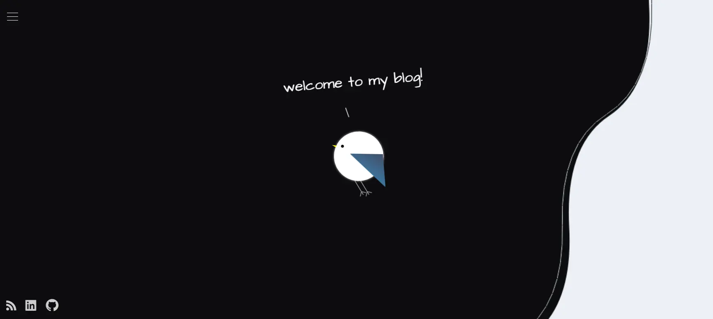

## Features

- **SSR + PWA** — Server-side rendering with offline support via service workers
- **Responsive Design** — Optimized for both desktop and mobile devices
- **Markdown Editor** — Full-featured editor with live preview (EasyMDE)
- **Syntax Highlighting** — Code blocks styled with highlight.js
- **Comments** — Built-in comment management system
- **Firewall** — IP-based access control, bot detection, custom rules with time scheduling
- **UA Collection Detection** — Detect distributed crawlers by grouping IPs sharing the same User-Agent
- **Cloudflare Integration** — Auto-push blocked IPs to Cloudflare IP Lists for edge-level filtering
- **Article Management** — Create, edit, and organize markdown posts
- **Tags** — Categorize content with a tag system
- **File Management** — Upload and manage static files and images
- **Visit Statistics** — Track page views (PUV) with an admin dashboard
- **Backup & Restore** — Export and import data for disaster recovery
- **Image Compression** — Automatic client-side image compression on upload
- **Blog Mode** — Publish posts publicly or keep them private
- **Self-Hosted** — Runs on your own server, all data stays with you

## Tech Stack

| Category | Technology |
|---|---|
| Framework | [SvelteKit](https://svelte.dev/docs/kit/introduction) (SSR) |
| Runtime | [Bun](https://bun.sh) |
| Database | SQLite via `bun:sqlite` |
| Styling | [SCSS](https://sass-lang.com) + [clsx](https://github.com/lukeed/clsx) |
| Fonts | [SUIT](https://sunn.us/SUIT/) · [Noto Sans SC](https://fonts.google.com/noto/specimen/Noto+Sans+SC) |
| Markdown Editor | [EasyMDE](https://github.com/Ionaru/easy-markdown-editor) |
| Markdown Renderer | [marked](https://marked.js.org) + [highlight.js](https://highlightjs.org) |
| Type Checking | TypeScript |

## Screenshots

### Desktop

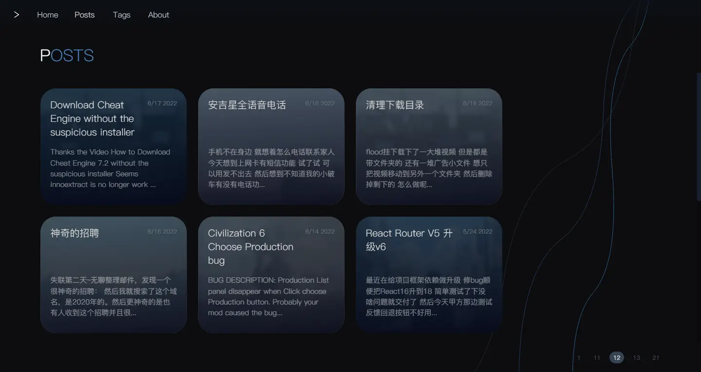
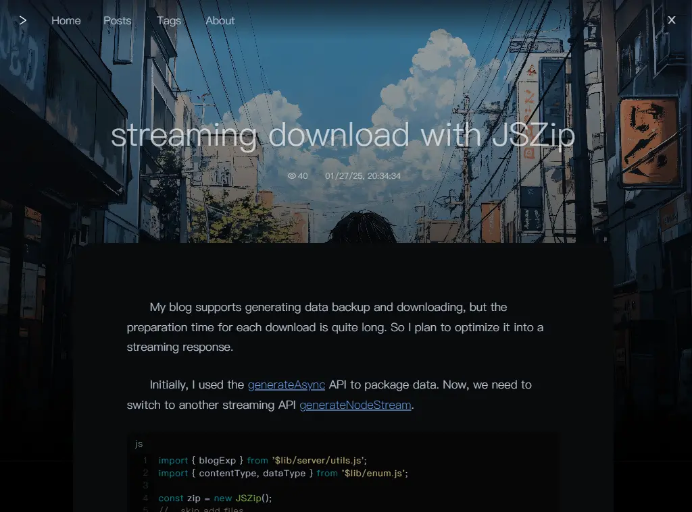
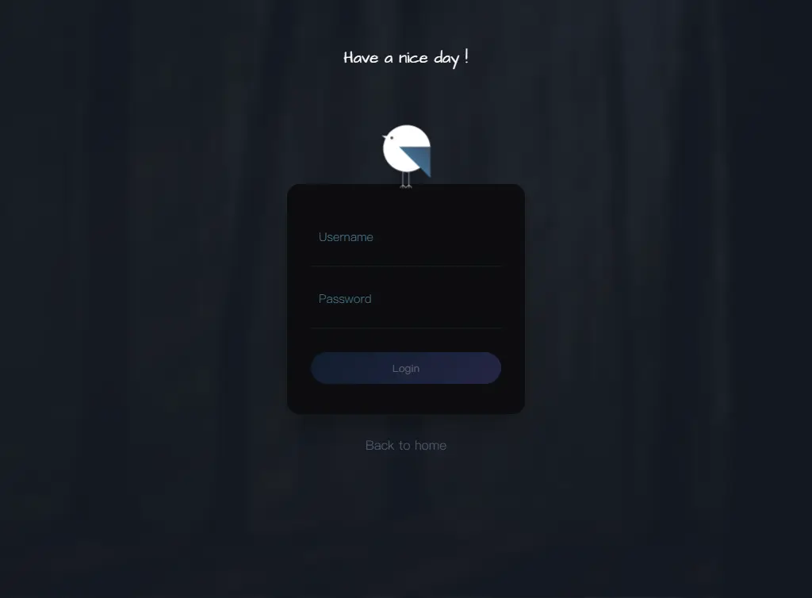
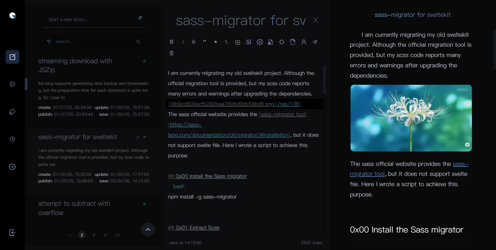
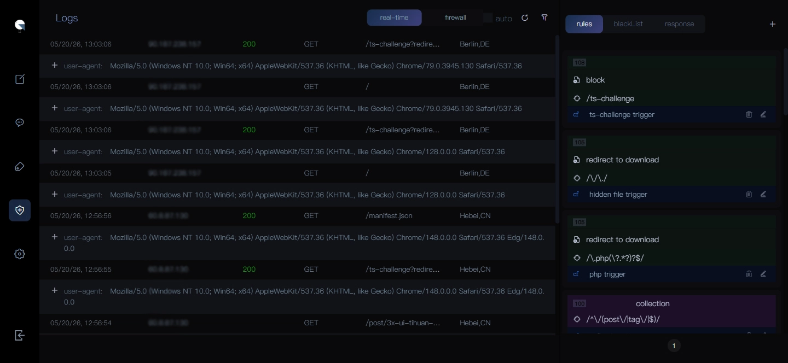
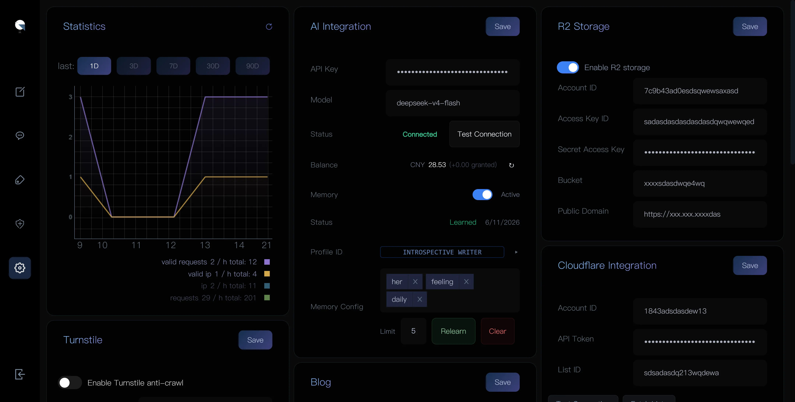

### Mobile

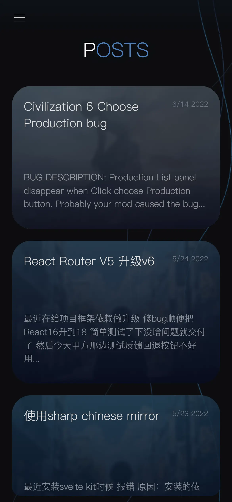
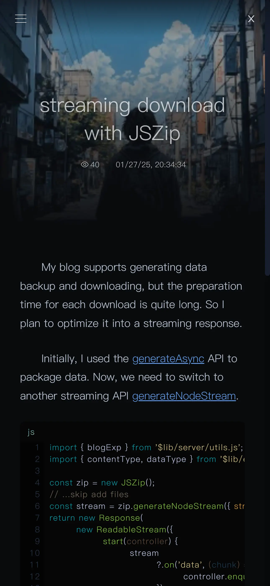
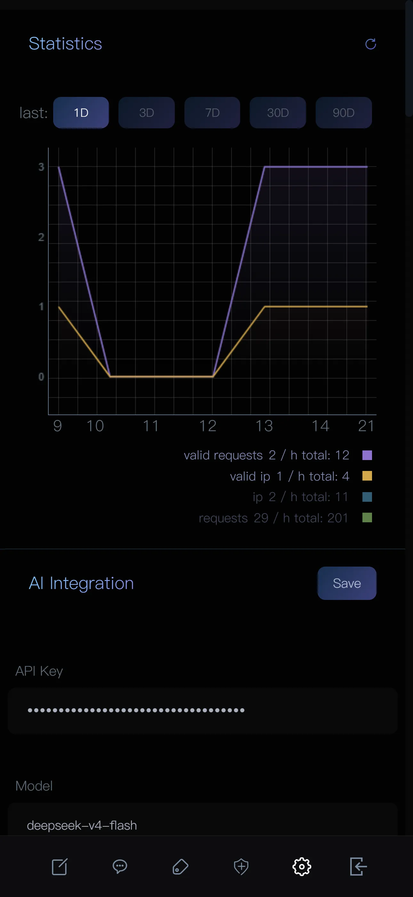
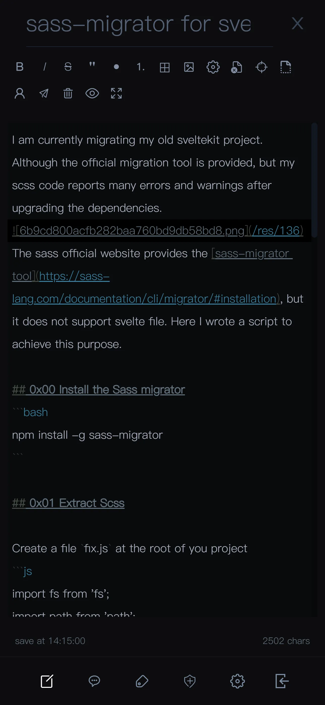
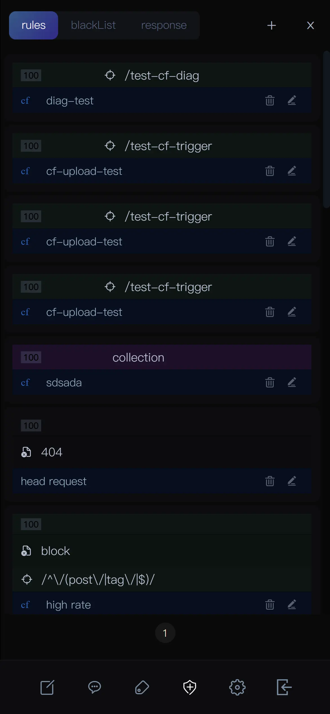

## Getting Started

### Prerequisites

- [Bun](https://bun.sh) (latest)

### Quick Start

```bash
# Clone the repository
git clone https://github.com/aolose/emm.git
cd emm

# Install dependencies
bun install

# Build for production
bun run build

# Start the server
bun run preview
```

The application will be available at `http://localhost:4173`.

### Production Deployment

```bash
bun install
bun run build
# The built output is in the `dist/` directory
# Deploy and run with: bun run dist/index.js
```

### Authentication

On first run, visit the `/config` page to set up your admin username and password. No registration system — single admin account.

### Configuration

All settings are managed through the Admin UI (`/admin/setting`), stored in the SQLite database:

- **Blog Info**: blog name, bio, SEO keywords/description, social links
- **Upload/Thumbnail Directories**: configurable storage paths for uploaded files and generated thumbnails
- **Geo Location**: ip2location lite token and database directory for IP-based country blocking (see [Geolocation access control](#geolocation-access-control))
- **Comments**: enable/disable comments, moderation toggle
- **Firewall Rules**: IP/header/path-based access rules, rate limiting, custom responses

### Geolocation access control

Uses [ip2location lite](https://lite.ip2location.com) to restrict access by country. Configure via admin settings:

1. Obtain an ip2location lite token
2. Set the token and database directory in **Admin Settings → Geo**
3. Create firewall rules with country-based conditions


## Turnstile Anti-Crawl Setup

When using Cloudflare Turnstile to protect your site, legitimate automated visitors such as search engine crawlers will also be blocked since they don't execute JavaScript. To ensure SEO crawlers can access your site, complete the following Cloudflare Transform Rule configuration before enabling Turnstile.

### Prerequisites

- Your site is proxied through Cloudflare (DNS records have the orange cloud enabled)
- You have admin access to your Cloudflare account

### Step 1: Create a Transform Rule

1. Log in to the [Cloudflare Dashboard](https://dash.cloudflare.com)
2. Select your site
3. Go to **Rules → Transform Rules → Modify Request Header**
4. Click **Create rule**
5. Configure as follows:

| Field | Value |
|---|---|
| Rule name | `Add Verified Bot Headers` |
| When (Field) | Bot |
| When (Operator) | equals |
| When (Value) | Known Bots |
| Then (Action) | Set static |
| Header name | `X-Verified-Bot-Category` |
| Header value | `cf.verified_bot_category` |
| Then (Action) | Set static |
| Header name | `X-Client-Bot` |
| Header value | `true` |

6. Click **Deploy**

After deployment, all requests identified by Cloudflare as verified bots will carry the `X-Verified-Bot-Category` and `X-Client-Bot` headers when forwarded to your origin server.

### Step 2: Origin Server Adaptation

EMM already includes the bot bypass logic in `src/lib/server/turnstile.ts`. The `isTsVerified` function checks these headers and skips the Turnstile challenge for trusted bot categories:

```ts
// Trusted bot categories from Cloudflare Verified Bots
const trustedCategories = [
  'Search Engine Crawler',  // Googlebot, Bingbot, etc.
  'Page Preview',           // Slack, Discord link previews
  'Feed Fetcher',           // RSS/Atom feed readers
  'Archiver',               // Internet Archive, etc.
];
```

No additional code changes are required on your part.

### Step 3: Secure Your Origin Server

> **Warning:** Attackers can forge headers like `X-Client-Bot` if they access your origin IP directly, bypassing Turnstile entirely. Take at least one of these measures:

- **Use [Cloudflare Tunnel](https://developers.cloudflare.com/cloudflare-one/connections/connect-networks/)** (recommended, most secure) — no open ports on your origin
- **Restrict origin firewall to [Cloudflare IP ranges](https://www.cloudflare.com/ips/)** — only accept traffic from Cloudflare's edge

### FAQ

**Q: Why not just check the User-Agent?**
User-Agent headers are trivial to spoof. Cloudflare's Verified Bot detection is based on IP reverse DNS verification, which is far more trustworthy.

**Q: What are the possible values of `cf.verified_bot_category`?**

| Category | Description |
|---|---|
| Search Engine Crawler | Googlebot, Bingbot, and other search engine crawlers |
| Page Preview | Link preview services like Slack, Discord |
| Feed Fetcher | RSS/Atom feed readers |
| Archiver | Archival services like Internet Archive |

**Q: What happens if I don't create this rule?**
All crawlers (including search engines) will be blocked by the Turnstile challenge. Your site may not be indexed by search engines.

## Data

On first run you will be asked to choose a database location. All data is stored in a single SQLite database.

Runtime files and directories:

- **SQLite database** — configured path (stores posts, tags, config, firewall rules, etc.)
- **Upload directory** — configured in admin settings (defaults to `data/upload`)
- **Thumbnail directory** — configured in admin settings (defaults to `data/thumb`)

## License

MIT © [Aolose](https://github.com/aolose)