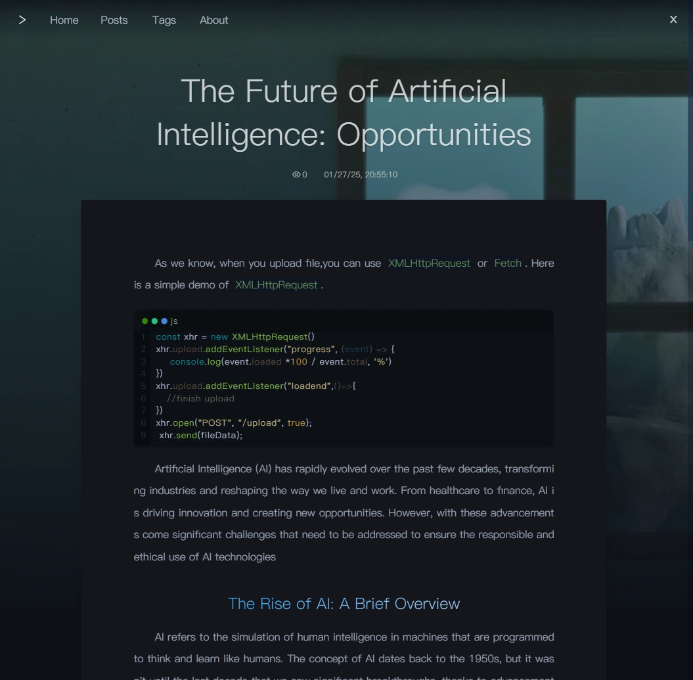
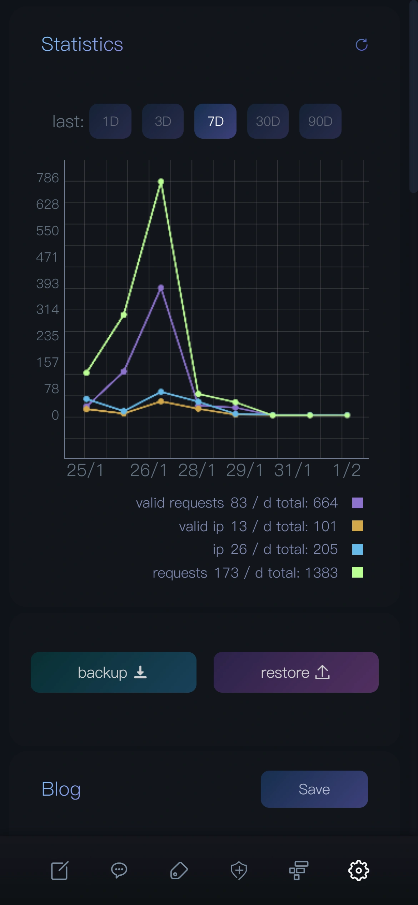

# A personal blog system

Here is my personal blog. I am currently using it to 
record my daily life and a small amount of technical
experience. I have been looking for a lightweight, 
fully functional (meeting my needs) blog. I hope it 
has a friendly writing experience, convenient file 
management, built-in comment integration and a 
beautiful interface, but unfortunately, I didn't 
find it. So I made such a blog. It is suitable for 
deployment on a vps with a bun environment (bun is 
great because it has built-in sqlite support). I 
didn't do any functional support in the direction of 
SEO or business, emm... it is only suitable for 
writing, and the theme cannot be modified. If you 
are interested in it, welcome to fork it.


The code of the current project is still very messy 
and far from the standard of an open source project. 
I hope to standardize it, but unfortunately I am lazy 
and busy in my daily life. But I will keep it updated 
and spend a few days every year to synchronize the 
technology stack.

### Tech Stack

[Bun](https://bun.sh/) +
[SvelteKit](https://github.com/sveltejs/kit) +
[bun:sqlite](https://bun.sh/docs/api/sqlite)

### Features

- SSR+PWA
- Mobile friendly (safari may not)
- Modified [EasyMDE](https://github.com/Ionaru/easy-markdown-editor) editor
- Comments management
- Firewall
- Article management
- Tags management
- Files management
- Permissions management
- Visit Statistics
- backup to local and upload recovery
- Image upload compression

### Features may be added

-[ ] Comment Notification, using email or bot 

### partial preview

#### For PC View
View Article




Login In


Write Article


Firewall


Blog Management (Long picture, please view the whole picture in a new tab)


### For mobile view




### Deploy

You need a bun environment vps.

- step1: build locally
  ```bash
  bun --bun run build
  ```
- step2: add package.json
  ```bash
  bun --bun run publish
  ```
- step3: upload the dist folder to your vps

- optional: crete the `.env` in dist folder if you want change the bind port

- step4: run it (If you need to run in the background, you could add a service)
  ```bash
  bun --bun run start
  ```
